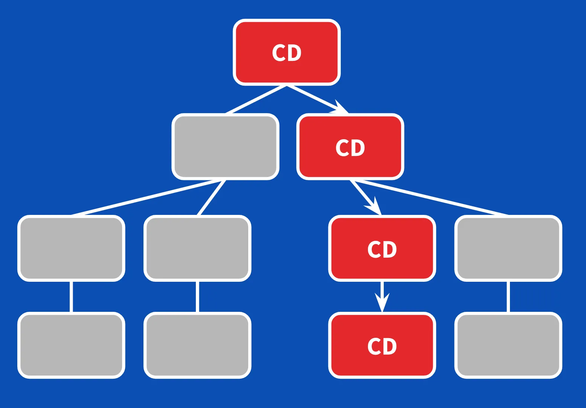

# Angular Advanced Forms

## Start
- `npm run dev`

## Intro
- [customer-editor.component.ts](src/app/page/customer-editor/customer-editor.component.ts)
- [customer-editor.component.html](src/app/page/customer-editor/customer-editor.component.html)

## JSON-based forms
- command: `ng g c common/form-json`
- [FormJsonComp.](src/app/common/form-json/form-json.component.ts)
- [FormJsonComp. html](src/app/common/form-json/form-json.component.html)
- create: `src/app/form/forms.ts`
- [Forms.ts](src/app/form/forms.ts)
- [CustomersComp: add form-json](src/app/page/customer/customer.component.html)

## Async Validation
- [CustomerService: query](src/app/service/customer.service.ts)
- [CustomerStore: createItem()](src/app/store/CustomerStore.ts)
- command: `ng g c page/customer-add`
- [CustomerAddComp.](src/app/page/customer-add/customer-add.component.ts)
- [CustomersComp: add button, remove country](src/app/page/customer/customer.component.html)
- [AppRoutes: customer/add](src/app/app.routes.ts)

## Multi-field Validation
- [FormJson: expand interface](src/app/common/form-json/form-json.component.ts)
```typescript
export interface IForm {
  name: string;
  fields: IField[];
  validators?: ValidatorFn[];
}
```
- change settings:
```typescript
if (formSettings.validators) {
  this.form.addValidators(formSettings.validators);
}
```
- [FormJson html](src/app/common/form-json/form-json.component.html)
```html
@for (err of form.errors | keyvalue; track $index) {
  <mat-hint>{{ err.value || 'Error' }}</mat-hint>
}
```
- [Forms.ts](src/app/form/forms.ts)
```typescript
name: 'Add new Customer',
validators: [
  (control: AbstractControl) => {
    const value = control.value;
    if (/^10/.test(value['ip_address']) && /\@\w*\..*$/.test(value['email'])) {
      return {emailIpError: 'Corporate emails cannot have a top-level domain.'};
    }
    return null;
  },
],
```

## ControlValueAccessor - Country Selector
- command: `ng g c common/country-selector`
- [CountrySelector edit](src/app/common/country-selector/country-selector.component.ts)
- 


## The slow app
- review:
- [main.ts](src/main.ts)
- [app.config.ts](src/app/app.config.ts)
- coding:
- [customer.component.ts](src/app/page/customer/customer.component.ts)

## OnPush strategy
- [customer.component.ts](src/app/page/customer/customer.component.ts)
```typescript
changeDetection: ChangeDetectionStrategy.OnPush,
```
- 

## Pipes
- command: `ng g pipe pipe/geo`
- [geo.pipe.ts](src/app/pipe/geo.pipe.ts)
- [customer.component.html: using pipe](src/app/page/customer/customer.component.html) 

## Memoize
- [geo.pipe.ts](src/app/pipe/geo.pipe.ts)
- [webpage](https://github.com/mgechev/memo-decorator)
- command: `npm i memo-decorator`
- Implementing the decorator.

## LoadComponent
- [app.routes.ts](src/app/app.routes.ts)
- [dashboard.component.ts](src/app/page/dashboard/dashboard.component.ts)

## Preloading 1
- Explain PreloadingStrategy
- Default: NoPreloading
- Set: PreloadAllModules
- [app.config.ts](src/app/app.config.ts)
```typescript
withPreloading(PreloadAllModules),
```

## Preloading 2
- [app.routes.ts](src/app/app.routes.ts)
- To preload, set: 
```
data: {
  prelodad: true,
},
```
- create: `src/app/service/flag-based.preloading-strategy.ts`
- [app.config.ts](src/app/app.config.ts)
```typescript
withPreloading(FlagBasedPreloadingStrategy),
```
